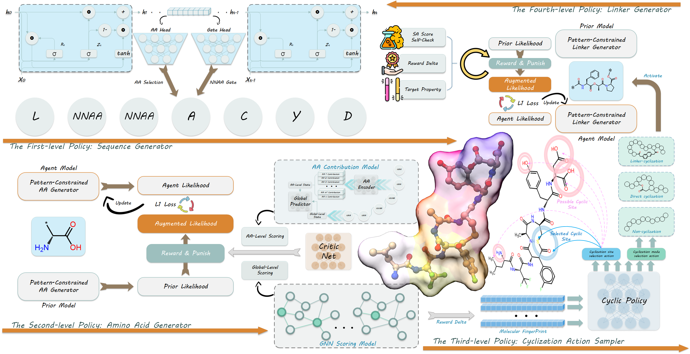

# 🧪 PepBrick:  Design of Peptidomimetics Using a Multi-level Nested Structured Reinforcement Learning Model

---

## 📄 Abstract
> **Abstract**
<p align="center">
  
</p>
Peptides feature a vast chemical space, extensive modifiability and an almost unlimited repertoire of unnatural amino acids, endowing them with the capacity to realize balanced optimization of multiple properties for specific therapeutic scenarios and generate ideal drug candidates. Accordingly, developing artificial intelligence-driven strategies to address the cost inefficiencies of traditional trial-and-error approaches, and to design multi-objectively optimized peptidomimetics via comprehensive chemical space exploration, has emerged as a critical imperative challenge in peptide drug development. To this end, we have developed PepBrick, a structured multi-level nested reinforcement learning framework. This framework explores the chemo-biological activity spatial landscape of peptidomimetics through a hierarchical residue-sequence-topology progression strategy, and further models and designs promising peptidomimetic candidates with potential for target diagnostic and thera
peutic applications. We fully validated PepBricks potential and robustness through systematic module-specific experi
ments and proof-of-concept applications in designing blood brain barrier-penetrating neuropeptides and tumor fluorescent probes. This work thus establishes a versatile and innovative paradigm for the development of next-generation peptide-based therapeutic agents.
---

## 🖼️ Overview
> **The PepBrick framework：** (i) Sequence Generation Module: Selects canonical amino acids from the candidate pool or activates the unnatural amino acid generation module when needed. (iii) Amino Acid Generation Module: Activated by the sequence generation module to produce diverse unnatural amino acid structures. (ii) Cyclization Policy Module: Determines the cyclization strategy and sites for linear peptidomimetics and decides whether to activate the linker generator. (iv) Linker Generation Module: Activated by the cyclization policy module to generate structurally feasible linker molecules. (v) Scoring Module: Incorporates a global-level graph neural network encoder, an amino-acid-level language model, and a Critic network to enhance training stability. This module outputs the reward signal for generated peptidomimetics and updates the parameters of the entire PepBrick framework.}

<p align="center">
  
</p>


---

## ⚙️ Environment Requirements

- **Python**: >= 3.8
- **CUDA** : >= 12.6
- **Key Dependencies**:
  ```text
  torch = 2.5.1
  numpy = 1.26.4
  pandas = 2.3.3
  scikit-learn = 1.6.1
  rdkit = 2025.03.5
  openbabel = 3.1.1
  torch_geometric = 2.6.1
