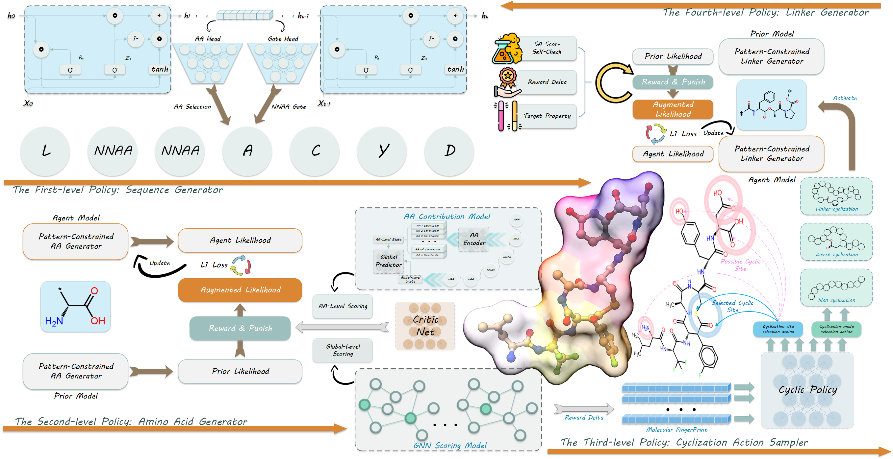

# 🧪 PepBrick:  Design of Peptidomimetics Using a Multi-level Nested Structured Reinforcement Learning Model

---

## 📄 Abstract
> **Abstract**
<p align="center">
  
</p>
Peptidomimetic design is fundamentally constrained by the strong coupling among noncanonical residues, sequence composition, and molecular topology within rugged, multi-objective fitness landscapes. To address this challenge, we developed PepBrick, a structured multi-level nested reinforcement learning framework that hierarchically represents peptidomimetics and decomposes the design process into controllable decision steps. By enabling coordinated optimization of chemical composition and molecular topology under multiple constraints, PepBrick provides a flexible strategy for navigating complex peptidomimetic design spaces. Systematic evaluation at both the component and integrated levels demonstrated its robust design capability. Moreover, the de novo design of blood-brain-barrier-penetrating neuropeptidomimeticss and tumor-targeting fluorescent probes, together with proof-of-concept molecular dynamics simulations, further demonstrated its effectiveness in navigating strongly coupled, multi-objective fitness landscapes. Collectively, these results establish PepBrick as a general computational framework for programmable peptidomimetic design and the development of next-generation peptide-based functional molecules.

---

## 🖼️ Overview
> **The PepBrick framework：** (i) Sequence Generation Module: Selects canonical amino acids from the candidate pool or activates the unnatural amino acid generation module when needed. (iii) Amino Acid Generation Module: Activated by the sequence generation module to produce diverse unnatural amino acid structures. (ii) Cyclization Policy Module: Determines the cyclization strategy and sites for linear peptidomimetics and decides whether to activate the linker generator. (iv) Linker Generation Module: Activated by the cyclization policy module to generate structurally feasible linker molecules. (v) Scoring Module: Incorporates a global-level graph neural network encoder, an amino-acid-level language model, and a Critic network to enhance training stability. This module outputs the reward signal for generated peptidomimetics and updates the parameters of the entire PepBrick framework.}

<p align="center">
  
</p>


---

## ⚙️ Environment Requirements

- **Python**: >= 3.8
- **CUDA** : >= 12.6
- **Key Dependencies**:
  ```text
  torch = 2.5.1
  numpy = 1.26.4
  pandas = 2.3.3
  scikit-learn = 1.6.1
  rdkit = 2025.03.5
  openbabel = 3.1.1
  torch_geometric = 2.6.1
